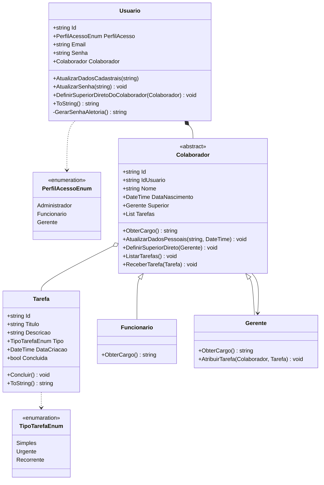

```mermaid
classDiagram
    direction TB

    class PerfilAcessoEnum{
        <<enumeration>>
        Administrador
        Funcionario
        Gerente
    }

    class TipoTarefaEnum{
        <<enumaration>>
        Simples
        Urgente
        Recorrente
    }

    class Tarefa{
        +string Id
        +string Titulo
        +string Descricao
        +TipoTarefaEnum Tipo
        +DateTime DataCriacao
        +bool Concluida
        +Concluir() void
        +ToString() string
    }

    class Colaborador {
        <<abstract>>
        +string Id
        +string IdUsuario
        +string Nome
        +DateTime DataNascimento
        +Gerente Superior
        +List Tarefas
        +ObterCargo() string
        +AtualizarDadosPessoais(string, DateTime) void
        +DefinirSuperiorDireto(Gerente) void
        +ListarTarefas() void
        +ReceberTarefa(Tarefa) void
    }

    class Funcionario {
        +ObterCargo() string
    }

    class Gerente {
        +ObterCargo() string
        +AtribuirTarefa(Colaborador, Tarefa) void
    }

    class Usuario {
        +string Id
        +PerfilAcessoEnum PerfilAcesso
        +string Email
        +string Senha
        +Colaborador Colaborador
        +AtualizarDadosCadastrais(string)
        +AtualizarSenha(string) void
        +DefinirSuperiorDiretoDoColaborador(Colaborador) void
        +ToString() string
        -GerarSenhaAletoria() string
    }

    Colaborador <|-- Funcionario
    Colaborador <|-- Gerente
    Usuario *-- Colaborador
    Colaborador --> Gerente
    Colaborador o-- Tarefa
    Usuario ..> PerfilAcessoEnum
    Tarefa ..> TipoTarefaEnum
```
